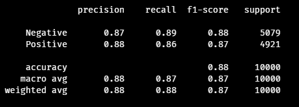

# Sentiment Analysis on IMDB Project

## Overview

This project involves performing sentiment analysis on movie reviews from the Internet Movie Database (IMDB). The goal is to classify reviews as positive or negative based on their review.

## Table of Contents

-   [Overview](#overview)
-   [Dataset](#dataset)
-   [Requirements](#requirements)
-   [Installation](#installation)
-   [Usage](#usage)
-   [Model](#model)
-   [Results](#results)
-   [Contributing](#contributing)
-   [License](#license)
-   [Acknowledgements](#acknowledgements)

## Dataset

The [dataset](https://www.kaggle.com/datasets/lakshmi25npathi/imdb-dataset-of-50k-movie-reviews) used for this project consists of IMDB movie reviews. It includes a balanced set of 50,000 reviews, with 25,000 labeled as positive and 25,000 labeled as negative.

## Requirements

-   Python 3.7+
-   NumPy
-   Pandas
-   scikit-learn
-   TensorFlow
-   Seaborn

## Installation

1. Clone the repository:

    ```sh
    git clone https://github.com/cafesuada24/Sentiment-Analysis-on-IMDB-Reviews
    cd Sentiment-Analysis-on-IMDB-Reviews
    ```

2. Install the required packages:
    ```sh
    pip install -r requirements.txt
    ```

## Usage

-   Prepare the data: In the root directory of the project, create a **data** folder and place your dataset file, _IMDB Dataset.csv_, inside it.

-   Train the model:

    ```sh
    python src\SentimentAnalysis.py --train your\csv\dataset\path [--output output\directory]
    ```

-   Predict sentiment of new reviews:

    ```sh
    python src\SentimentAnalysis.py --review "Your movie review here" [--model your\model\path]
    ```

    ```sh
    python src\SentimentAnalysis.py --file input\csv\file [--model your\model\path]
    ```

-   For further details, run:
    ```
    python src\SentimentAnalysis.py --help
    ```

## Model

The model used in this project is a neural network built with TensorFlow. It consists of an embedding layer, followed by LSTM layers and dense layers. The model is trained to minimize binary cross-entropy loss and optimized using the Adam optimizer.

## Results

The model achieves an accuracy of XX% on the test dataset. Below is the confusion matrix and classification report:




## Contributing

Contributions are welcome! Please open an issue or submit a pull request.

## License

This project is licensed under the MIT License. See the [LICENSE](LICENSE) file for details.

## Acknowledgements

-   [Kaggle](https://kaggle.com/lakshmi25npathi/imdb-dataset-of-50k-movie-reviews) for providing the movie reviews dataset.
-   [TensorFlow](https://www.tensorflow.org) for the machine learning framework
